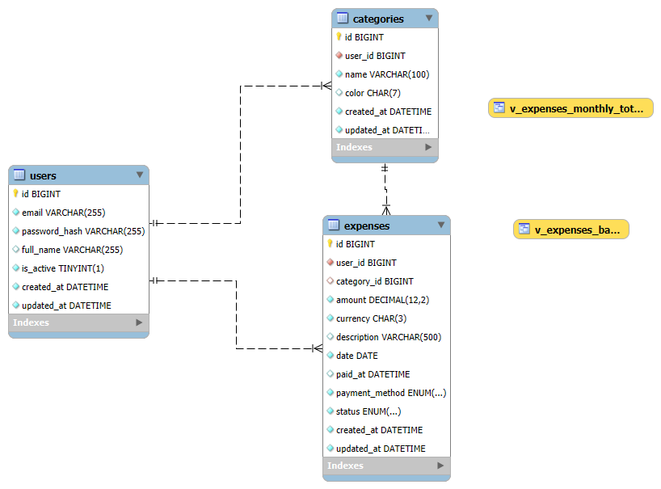

[](https://classroom.github.com/a/TW8lCRpT)
# 💰 Expense API – FastAPI + SQLModel + MySQL

Este projeto implementa uma **API RESTful** para gerenciamento de despesas pessoais, com autenticação JWT.  
Ele foi desenvolvido como parte da disciplina de Megadados no Insper (2025-2).

---

## 🚀 Tecnologias Utilizadas
- [FastAPI](https://fastapi.tiangolo.com/) – framework web moderno e rápido
- [SQLModel](https://sqlmodel.tiangolo.com/) – ORM baseado em SQLAlchemy + Pydantic
- [MySQL 8](https://www.mysql.com/) – banco de dados relacional
- [Uvicorn](https://www.uvicorn.org/) – servidor ASGI de alta performance
- [JWT (JSON Web Tokens)](https://jwt.io/) – autenticação segura
- [Docker](https://www.docker.com/) – containerização do MySQL
- [Postman](https://www.postman.com/) – testes da API

---

## 📦 Estrutura do Projeto
```
app/
 ├── core/           # Configurações, segurança e dependências
 ├── db/             # Engine, models e schemas (ORM)
 ├── routers/        # Rotas da API (auth, categories, expenses)
 ├── main.py         # Ponto de entrada da aplicação
```

---

## 📊 Modelo Relacional

Abaixo está o diagrama das tabelas utilizadas neste projeto:



> O arquivo original do diagrama está disponível em `/docs/db_schema.png`.

---

## ⚙️ Configuração e Execução

### 1. Subir o banco MySQL em Docker
```bash
docker run --name mysql8   -e MYSQL_ROOT_PASSWORD=secretroot   -e MYSQL_DATABASE=expense_app   -e MYSQL_USER=expense   -e MYSQL_PASSWORD=expensepwd   -p 3306:3306   -d mysql:8.0   --default-authentication-plugin=mysql_native_password
```

### 2. Instalar dependências
```bash
pip install -r requirements.txt
```

### 3. Rodar a API
```bash
uvicorn app.main:app --reload
```

### 4. Acessar a documentação interativa
- Swagger UI → [http://127.0.0.1:8000/docs](http://127.0.0.1:8000/docs)
- Redoc → [http://127.0.0.1:8000/redoc](http://127.0.0.1:8000/redoc)

> 🔗 Link direto para testes no Swagger: [Swagger - Expense API](http://127.0.0.1:8000/docs)

---

## 🔑 Autenticação
A API usa **JWT**.  
Fluxo básico:
1. Criar usuário em `/auth/register`
2. Fazer login em `/auth/login` → recebe `access_token`
3. Usar o token em rotas protegidas com header:
   ```
   Authorization: Bearer SEU_TOKEN
   ```

---

## 📌 Endpoints Principais

### Auth
- `POST /auth/register` → cria novo usuário
- `POST /auth/login` → autentica usuário e gera token
- `GET /auth/me` → retorna informações do usuário autenticado

### Categorias
- `POST /categories` → cria categoria
- `GET /categories` → lista categorias
- `PUT /categories/{id}` → atualiza categoria
- `DELETE /categories/{id}` → exclui categoria

### Despesas
- `POST /expenses` → cria despesa
- `GET /expenses` → lista despesas com filtros
- `GET /expenses/{id}` → busca despesa por ID
- `PUT /expenses/{id}` → atualiza despesa
- `DELETE /expenses/{id}` → exclui despesa

### Relatórios
- `GET /expenses/summary/monthly?year=2025` → totais mensais
- `GET /expenses/summary/by-category?start=2025-10-01&end=2025-10-31` → totais por categoria

---

## 🧪 Testes
Os testes foram realizados via **Postman**:
- Registro, login e autenticação
- CRUD de categorias
- CRUD de despesas
- Relatórios (totais por mês e categoria)

Você pode importar a coleção pronta do Postman (disponível neste repositório).

---

## 🎥 Demonstração em Vídeo
👉 [Assista no YouTube](https://youtu.be/GVDFlIChfcA)  

---

## 👤 Autor
Projeto desenvolvido por **João Pedro QUeiroz Viana** como parte do curso no **Insper – Megadados (2025/2)**.